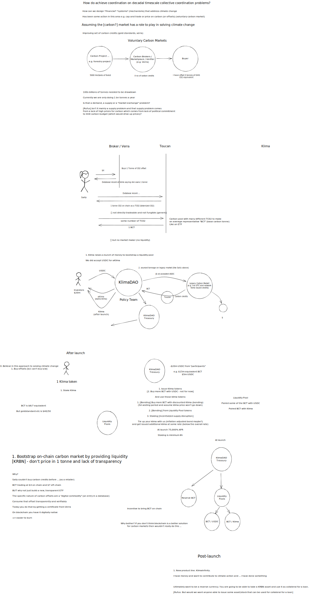
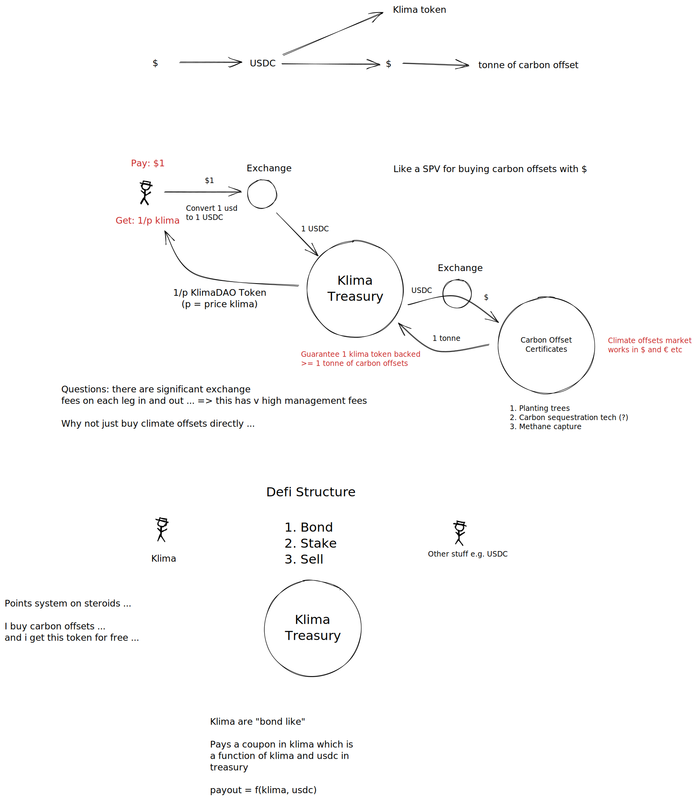

# Klima

> ## A DAO, A PROTOCOL, AN ECOSYSTEM
> 
> KlimaDAO’s goal is to accelerate the price appreciation of carbon assets. A high price for carbon forces companies and economies to adapt more quickly to the realities of climate change, and makes low-carbon technologies and carbon-removal projects more profitable.
> 
> Through the KLIMA token, we will maximize value creation for our community and create a virtuous cycle of growth. Eventually, the KLIMA token (each backed by real, verified carbon assets) will function as a truly sustainable asset and medium-of-exchange, with real planetary value.

# Commentary

Looks like the algo stable coin part isn't going so well. Similar to [[dao/olympusdao.finance]]

# Analysis v2 - April 2022

**UPDATE: 2022-05-06. Extensive conversation with KlimaDAO team yielded this summary**

Entire Deep Dive episode on KlimaDAO released: [collective-action-problems-and-climate-change](../notes/collective-action-problems-and-climate-change.md). Here's the drawing we did.

### More notes

Understanding how it works ...

https://docs.klimadao.finance/klima-dao-ecosystem

* BCT = "Base Carbon Tonne"
  > The BCT (Base Carbon Tonne) — KlimaDAO's reserve asset — is a carbon offset index token representing a basket of different tokenised carbon tonnes starting with `TCO2`. [https://docs.klimadao.finance/klima-dao-ecosystem]

### What is the price of the BCT

Since the BCT is what they hold in the treasury and provides the core "intrinsic value" it is important to understand what it's price is.

* Klima DAO’s current capture cost is ~8 usd/tn (the price of BCT tokens) [https://hristovbz.medium.com/klima-dao-for-apes-degens-ogs-195af0b4cd0b - Nov 30 2021]
* This seems low see e.g. this post from KlimaDAO itself https://klimadao.medium.com/carbon-markets-retail-offset-pricing-4eab0f6196c0 which includes this graphic
  
   

# Analysis v1 (first pass Dec 2021)
https://docs.klimadao.finance

* It takes significant work to work how this actually works ... (is it like [[dao/diatom.fund]] which has a relatively clear diagram ...)
* (I think) Klima tokens are minted when they buy carbon offsets and store them in the treasury

## The Problem (with some very dubious analysis)

> We generally consider that the market itself is rational, and assume that it values things in a perfect way. We ignore the paradoxes in front of us everyday. Water, a necessity for life is essentially free across (much of) the world; diamonds have no real utility for us, yet in the free market they are priced exorbitantly, excluding all but the world’s richest.

Who is we here? This is the diamond-water paradox which is precisely about how price != value ... (rather price arises from intersection of demand and supply ...)

> In the past, the market price of a good was determined by the socially necessary labour inputs required to create it. In recent times we have moved to a system where subjectivity and speculation are key driving forces behind prices.

This the (very erroneous) marx-originated labor theory of value. Price was never (purely) determined by the labor inputs to create something.

> Value has become totally detached from the ‘market’.

Well it was always only partly related ... And there are other reasons that is now so (information economy etc).

## What KlimaDAO does

> Klima DAO gives Web3 builders and users the opportunity to participate in the carbon market through the KLIMA token. KLIMA tokens are:
> 
> -   fungible: per the ERC20 token standard   
> -   backed: by at least 1 tonne of tokenized verified carbon offsets locked in the Klima DAO treasury
> -   useful: holders of KLIMA will have the ability to vote on Klima DAO policy
> 
> Therefore, the DAO serves the role of "de-central" bank, governing the monetary policy of this new carbon-backed currency, just as a central bank governs the monetary policy of a fiat currency. Over time, we will build an economy around KLIMA by driving adoption and unlocking growth of the _crypto-carbon_ economy.
> 
> By developing Klima DAO on transparent and open-source infrastructure, participation from Web3 developers, carbon projects, and climate experts will be welcomed, to both build this new economy and be rewarded for their contributions.

Any clearer?

## https://docs.klimadao.finance/klima-dao-ecosystem

# Inbox

* Dashboard for KlimaDAO https://dune.com/Cujowolf/Klima-DAO
