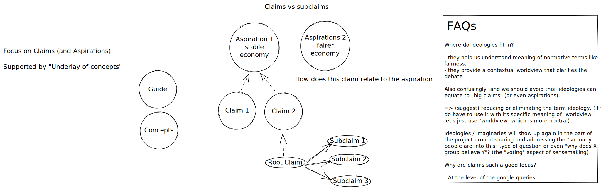

# Design of the Site and Project

e.g. information architecture, job stories etc.

Launchable and *announceable* website.

# Wireframes and Mockups

### Home page

Mockup of home page (design): https://excalidraw.com/#room=8bc8a0afb0afc89015dc,W3jd48r8_B2llA2CZ8A33A

v0.1 Wireframe

# Content Plan (and Info Architecture)

Excalidraw version: https://excalidraw.com/#room=77b4b0841586502dc440,OS7tGXbkYEf_W5Lgu8PflA

* Guide `/guide/`: 
* Claims `/claims/`: TODO better name for this
* Notes `/notes/`
* Concepts `/concepts/`: set of key concepts
* Library `/library`: 

Currently have `ideologies` folder too. I wonder if we merge into notes.

## Claims

For work on this see https://github.com/life-itself/web3/issues/192

## Journey as a user ...

* SD links a journalist to the library or a specific concept
* I want an intro to web3 & crypto ... => /guide/

and then i'm reading it and it links out to other material

Collections we want to curate

- Deep Dives
- Claims
- Concepts

Types of thing in the space

- DAO
- Tokens
- Crypto Assets
- ICOs
- People

Conceptual

- Web3
- Crypto

Flow / UI

- Featured / Blog

# Issue Tree

* [x] How rough and ready are we in process and hence appearance? **✅2022-03-11 publish early, publish often and accept being "rougher" though flagging what is polished and not. - see [how-rough-and-ready](how-rough-and-ready.md)**
* [ ] Do we need to distinguish claims from aspirations from debates from questions people have?
* [ ] Are questions vs hypotheses a better way to frame (or even more attractive on the internet)
  * Questions seem less polarizing: Crypto will transform the world ... vs Can Crypto transform the world?
    * In a proper thesis setup where everyone understands we are dealing in claims and examining them and brings a rigorous open-mindedness then theses are better because can be evaluated ...
    * But we can always turn a claim into a question and vice-versa ...
    * Hypotheses are more accurate than claims but a bit more obscure in terminology
  * H: (70%) use questions rather than claims/hypotheses
* [x] Do we call ourselves "Making sense of Web3" or "Making sense of Crypto and Web3" or "Making Sense of Crypto" **✅2022-03-11 Making sense of crypto and web3**
  * [x] Do we mention Crypto at all? ✅ **Yes, crypto is more widespread and even less controversial in definition so definitely want to mention it**