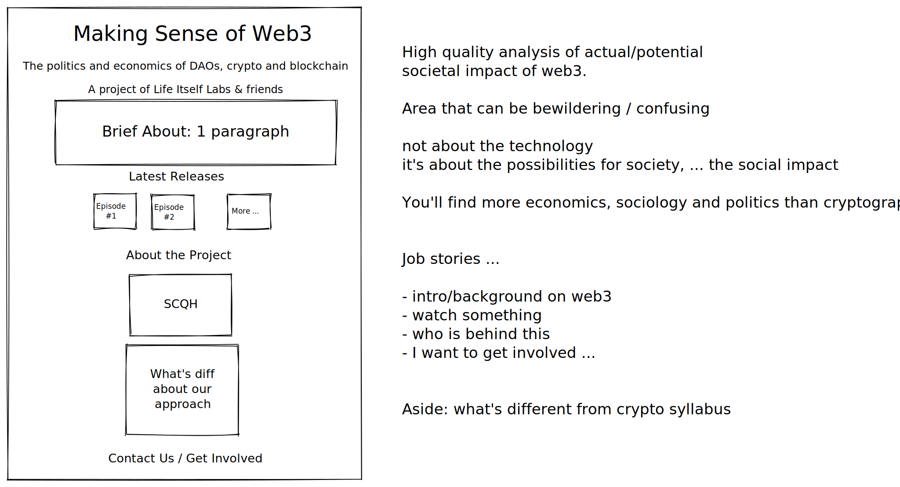

# Plan

# Goals

Features

* **MMVP website up** so that we can share with people
  * with a signup offer
  * with a participate offer?
* **Announced e.g. on Emerge, Blog etc** so that more people find out about this, & we have articulated the purpose of the project clearly
* **About the project (? + thesis of structured sensemaking)** so that we can share about the project to others esp more in depth
* **Library (based on Zotero)** so that we have a place to collect the upper layer of the sensemaking info graph
* **Taxonomy for library and other material**
* **Concept underlay** so that ...
* **Wiki system**

## Milestones (WIP)

* [ ] v0.1: single page site for the project, vision for the project
* [ ] v0.2: Working wiki + 1 substantive essay
* [ ] v0.3: ...
* [ ] v1: website with integrated library and wiki. contribution flow.

# Timeline

## Fri 11 March - v0.1

Outcome visioning: site polished and project launched

* [ ] Elegant site
  * [ ] Home Page
  * [ ] Library
  * [ ] Guide
* [ ] Announce
  * [ ] People contacting us
  * [ ] More github stars

What is our definition of launchable?

- front page looks good (or ok?)
- videos up somewhere on the front page

# Workstreams

* [ ] Online web "home" for the published material e.g. "Making Sense of Web3" so that ... ⏫ **🏃‍♂️ For v0.1 https://github.com/life-itself/web3/issues/53 issue**
* [ ] Collaboration and Contribution (paths and involved already interested people) so that we get more contributions
* [ ] Content ⏫ **see below and https://github.com/life-itself/web3/issues/55 issue**
* [ ] Library 🔼 see https://github.com/life-itself/web3/issues/44
* [ ] Engagement and signups
  * [ ] ⏫ Sign up to get updates / news …
  * [ ] Subscribe to our youtube channel

# Content

* [ ] Finalize issue trees
  * [x] Merge Theo/Rufus issue tree **2022-02-25 done by Catherine**
  * [x] Tidy up main issue tree **✅2022-02-28 largely done today - last branch in main issue tree on collective sensemaking still needs some work**
  * [x] Transfer to spreadsheet and add details e.g. material needed, prioritization 
* [ ] Publish issue trees
* [ ] Reports - write up well with good referencing [aside: how easy is it to pdf in “proper” format via Git e.g. like the primers one]
* [ ] Publishing an announce/intro piece on e.g. Emerge
  * [ ] BONUS: (or 2nd article) is about this an exemplar for collective sense-making in a “time between worlds”
* [ ] ⏫ What material do we already have ...? **🏃‍♂️ 4 interviews, SCQH ...**
* [ ] ➕2022-02-26 What we are bringing / aiming for (and what’s distinctive about this approach)
  * [ ] Write up our approach to sensemaking and why it matters (write up existing notes into a coherent essay)
    * [ ] Interview Rufus and/or Stephen to clarify what’s the challenge in the sensemaking

# Website

## Tasks

* [ ] Home page
* [ ] Analytics
* [ ] Library page
* [ ] Guide page
* [ ] Navbar
* [ ] Notes section (wiki)

### Home Page

Sketch of home page

Mockup of home page (design): https://excalidraw.com/#room=8bc8a0afb0afc89015dc,W3jd48r8_B2llA2CZ8A33A

* [ ] Home page
  * [ ] Hero
    * [x] Layout
    * [ ] Remove "Get updates" & replace with CTA
  * [ ] Latest releases
    * [ ] Replace images either with YouTube video embed or the thumbnail image (?)
  * [ ] Guide
  * [ ] Get involved (front page)

### Library Page

Acceptance

* [ ] `/library` landing page exists
* [ ] brief overview
* [ ] links to zotero
* [ ] Also explanation of how to contribute incl organizational structure

Tasks

* [ ] Basic text for library page e.g. what, etc
* [ ] Link or embed the full library

### Guide

plan of content https://coggle.it/diagram/YidoEewvuAnxT9LA/t/web3-crypto-guide-toc

* [ ] Stub `/guide/` page and could reuse quite a bit of about as introduction

### Get involved `/get-involved/`

* Developers => contribute on github
* Non-developers
  * Researchers / academics etc
    * Contribute to the library, for example by adding articles and research on web3 and background topics.
    * Write up key concepts and ideas.
    * Proof edit articles and transcribe dialogs.
* General: check out our videos and resources
  * Share the work with others
* Feedback: share it on the discussions

### Misc stuff

* [ ] Logo (could auto-generate)
* [ ] Issue tree image
  * [ ] Export it or embed?
  * [ ] Make it simpler
* [x] can we use symlinks to display content from main part of the repo into the site itself **✅ Yes you can. Rufus has this working**

### Someday

* [ ] (Front page?) Aside: Turning the SCQH into a tree esp the complication (note we have a bunch of this structure in the long version of the SCQH with bullet points). Why? A nice illustration of the hypothesis tree approach.